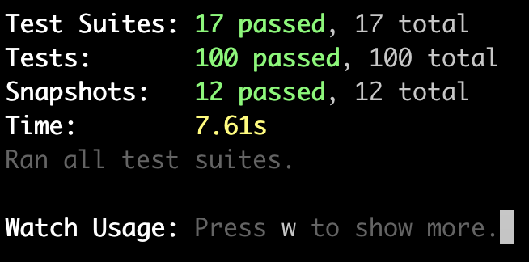
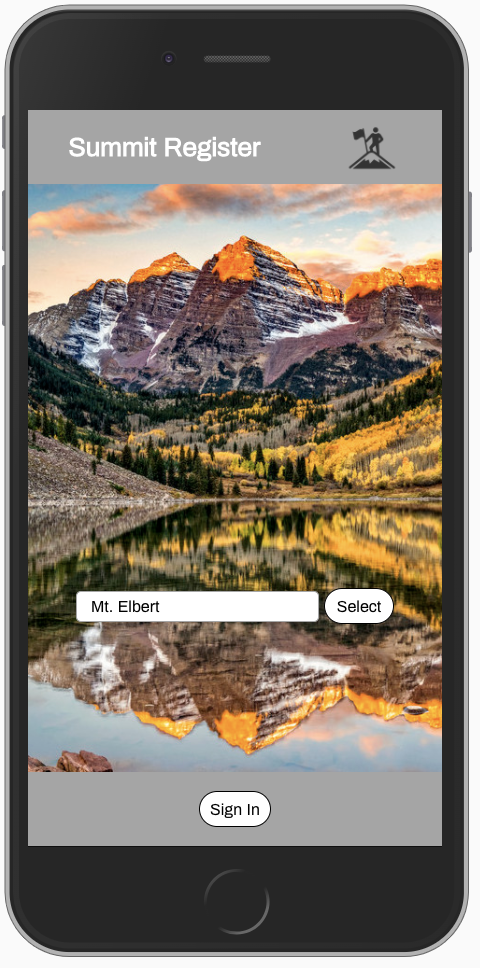
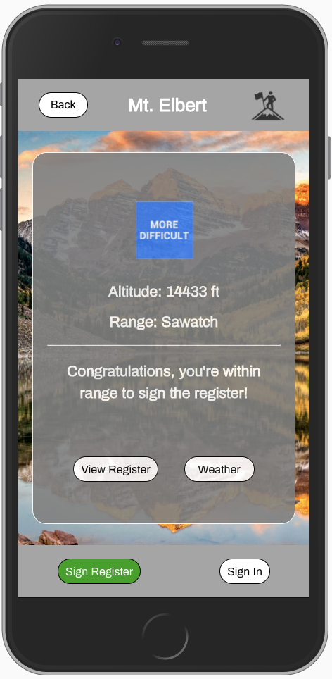
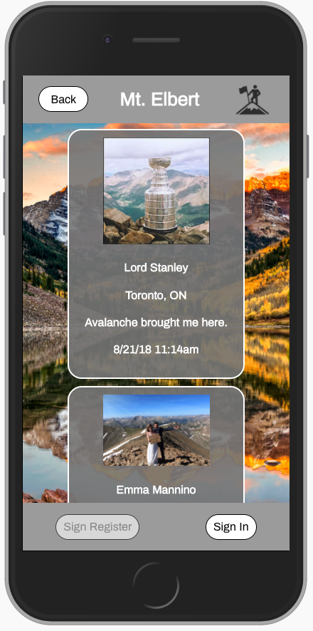
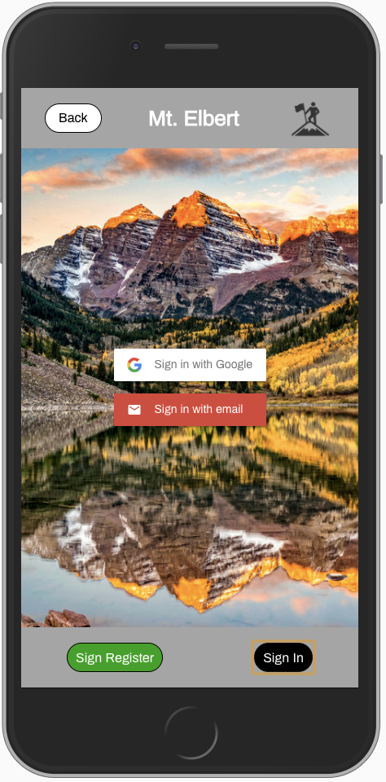
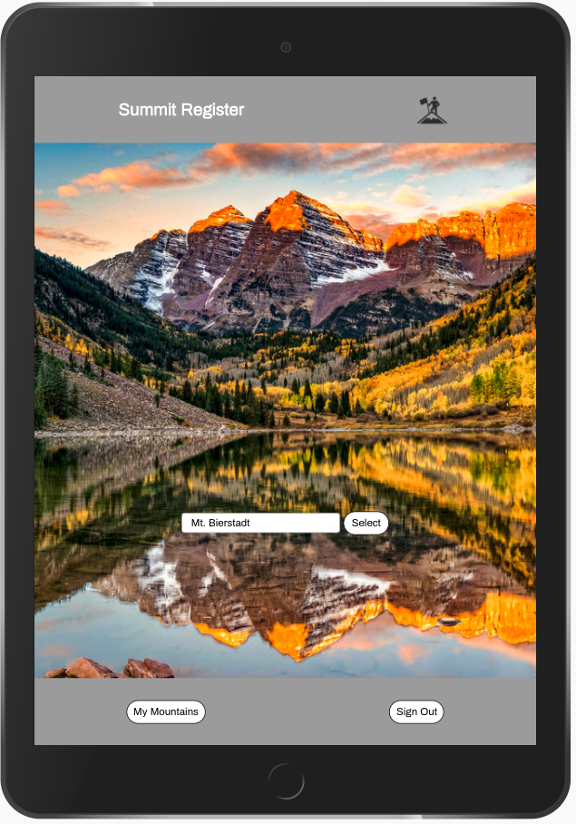
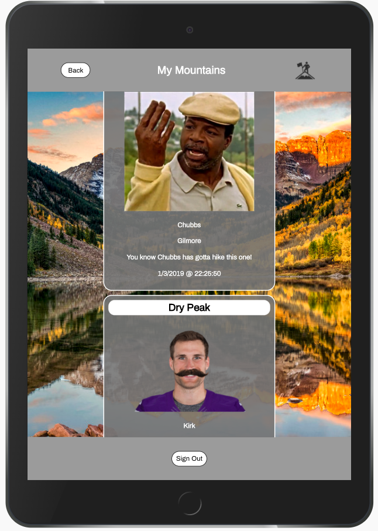

# Summit Registry
 

 

## [See it Live on Heroku!](https://summit-register.herokuapp.com/)

### Primary technologies
* React JS
* Enzyme/Jest
* Google Firebase

### Setup

1. Clone down repo
2. `npm install` from root directory
3. `npm start` and visit `localhost:3000` in your browser

### Test Driven Development

Summit Registry uses Jest and Enzyme for all testing purposes

`npm test` from the associated root directory

### Contributors

#### Front End
[Chris Chateau](https://github.com/christopherchateau) 
[Justin Stewart](https://github.com/Jstewart3313) 

#### Back End
[Andrew Tobin](https://github.com/andrewetobin)
[Andrew Mockett](https://github.com/MacInnes) 

### Next Steps
Additional enhancments could include :
* Ability for User to share image to social media
* Ability for the User to add a banner to any photo taken or uploaded
* Geolocation knows which mountain summit is closest without the selection of a mountain from the User

### ScreenShots

#### Mobile View

#### Summit Register was presented at the Turing Demo Competition on Jan 24th 2019

